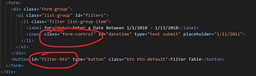
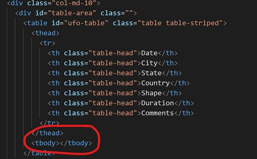

# UFO-LEVEL-1: Javascript and DOM (Document Object Model) Interactive Dashboard

I've created an interactive dashboard using Javascript, DOM manipulation, HTML, and CSS. We use a dataset that fan's of The X-Files will be excited about. In this application you will be able to enter a date query to populate a table with data from a local data-file.

There's are four files that work in unison in this app: 
* HTML with the structure of the web dashboard - with code from [Bootstrap4](https://getbootstrap.com/)
* CSS file with style elements for the webpage
* Data file of an array of objects in javascript
* Javascript to manipulate the [Document Object Model](https://www.w3.org/TR/REC-DOM-Level-1/introduction.html) of the HTML

## Four Takeaway Concepts

1. Identify HTML elements for event listener/handler DOM manipulation:



2. Event Listener/Handler - Identify the HTML elements/nodes to listen to for changes using the javascript functions:
```javascript
// create listeners for both the entry form and the button
// these variables will "listen" to an action that happens to that html element
var button = d3.select("#filter-btn");
console.log(button.html())
var form = d3.select(".form-control");
console.log(form.html())

// create "event handlers" for each of the button and the form
// ".on('event', function)" will run a function based on an event that happens with the listener variable
button.on("click", runEnter);
form.on("submit", runEnter);
``` 

3. Identify HTML element to create the output table:



4. Use Object.entries() and .forEach() to iterate and populate the table body of the HTML node:
```javascript
// loop function. use ".forEach()" function to iterate through the array of objects
// with each iteration we add a row and cells from the filtered data
// we use the arrow function for elegance 
filteredUfo.forEach(ufo => {
    console.log(ufo);
    // with each iteration we append a row "tr" to the table body element/node and store it as a variable "row"
    var row = table.append("tr");

    // we use "Object.entries()" function to break out the key and value of each entry in the object
    // we iterate through the array of entries with the .forEach() function to populate the HTML table with our script
    Object.entries(ufo).forEach(([key, value]) => {
        console.log(key, value);

        // we use the .append() function to add a "cell" element "td" to the row
        var cell = row.append("td");
        // for each "cell" we will write the value of the iterated object "value"
        cell.text(value);
    })
})
```

## The end result should be a table that shows all the UFO data sightings from that date. 


### All rights reserved 2020. All code is created and owned by Jay Sueno. If you use his code, please visit his LinkedIn and give him a a skill endorsement in javascript, html, css, and data science. Visit him at:

### https://www.linkedin.com/in/jay-sueno-359a274/
